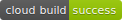

# NG Todo

The only todo app you'll ever need.

The app is available [here](https://ngx-todo.com) and can be used inside any browser on any platform.

## Basic Setup
1. Clone the repository with `git clone https://github.com/daniel2202x/ngx-todo`
2. Run `npm install`
3. Run `npm run firebase:emulator` to launch the Firebase emulator
4. Run `ng serve` or `npm run serve` to spin up a dev server on `http://localhost:4200`

## Explanation of scripts in package.json
| Command | Description |
| --- | --- |
| `serve` | Same as `ng serve`, uses the default locale `en` |
| `serve:de` | Same as `npm run serve` but uses the German locale `de` |
| `build:test` | Builds the app using the default configuration `production` |
| `build:prod` | Builds the app using the configurations `production` and `include-service-worker` |
| `lint` | Runs the configured linter |
| `extract-i18n` | Builds the app and recreates `src/locale/messages.xlf` |
| `e2e` | Same as running `npm run serve` and then `npm run cypress:open` |
| `cypress:open` | Opens the Cypress UI ready for testing |
| `cypress:run` | Runs all Cypress tests in headless mode |
| `cypress:docker` | Runs all Cypress tests in Docker |
| `firebase:emulator` | Runs the Firebase emulator in Docker |
| `docker:serve` | Builds and serves the app locally similar to a production environment |